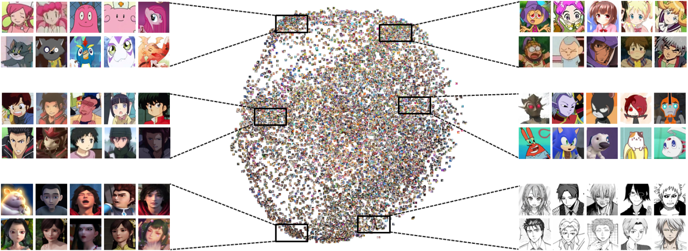

# iCartoonFace

### [**Dataset**](#Download)  [**Citation**](#Citation) [**Video**](https://www.youtube.com/watch?v=xOT1MiEp-uU) [**Paper**](https://arxiv.org/pdf/1907.13394.pdf) [**Project**](https://iqiyi.cn/icartoonface)   

The iCartoonFace project is supported by iQIYI. And this repository provides iCartoonFace dataset and baseline approaches of the following paper:

> **Cartoon Face Recognition: A Benchmark Dataset.**   
> Yi Zheng, Yifan Zhao, Mengyuan Ren, He Yan, Xiangju Lu1, Junhui Liu, Jia Li     

## Cartoon Face Detection

The iCartoonFace detection dataset is a large-scale dataset established for cartoon face detection, which contains multiple styles. In the iCartoonFace detection task, the mAP (mean average precision) metric is used to evaluate the performance of the algorithm.

## Cartoon Face Recognition

The iCartoonFace recognition dataset is a large-scale challenging dataset established for cartoon face recognition. The above figure visualizes the statistics of the proposed dataset. In the iCartoonFace recognition task, given a probe photo and a gallery containing at least one photo of the same cartoon character, the algorithm needs to rank-orders all photos in the gallery based on similarity to the probe.

Reference method: [insightface](https://github.com/deepinsight/insightface) or [reid-strong-baseline](https://github.com/michuanhaohao/reid-strong-baseline)

## Download

- The iCartoonFace detection train and test dataset:  [爱奇艺网盘](https://fft.cloud.iqiyi.com/s/bUbcwxz )  (密码: 1ZdlyJ)or  [Google Drive](https://drive.google.com/drive/folders/1ARKrhmGAMwVNr8M9kXgDzMUDhzusLxb7?usp=sharing)
- The iCartoonFace recognition train and test dataset: [爱奇艺网盘](https://fft.cloud.iqiyi.com/s/bUbdw5A ) (密码: 5Kv2M1)or  [Google Drive](https://drive.google.com/drive/folders/1m6pAL9Wbn8B1td0hFUj9RVRrSweNKskW?usp=sharing)
- The iCartoonFace recognition personid infomations: [爱奇艺网盘](https://fft.cloud.iqiyi.com/s/cji77eS ) (密码: N163o4)or  [Google Drive](https://drive.google.com/file/d/1rOmoseZXAKG5y7mkEsVAoaWan2dIrMzD/view?usp=sharing)

##  Test Dataset Label

- iCartoonFace detection test dataset label:  [爱奇艺网盘](https://fft.cloud.iqiyi.com/s/b8r3nn8 )  (密码: 2s6h2X)or  [Google Drive](https://drive.google.com/file/d/1qiHHCP1RvMl6kH017pAV8-QDdcMyy8PR/view?usp=sharing)   
- iCartoonFace recognition test dataset label: [爱奇艺网盘](https://fft.cloud.iqiyi.com/s/b8r6fX2 ) (密码: X6fgYZ)or  [Google Drive](https://drive.google.com/file/d/1HmmPgvE6xlGr_UOmEac6pczHLtYjipzp/view?usp=sharing)   
- As for the recognition test dataset label, it consists of filename x1 y1 x2 y2 label_id. If the label id equals -1, it represents the image label does not belong to any of the current classes.
- Evalution code: [爱奇艺网盘](https://fft.cloud.iqiyi.com/s/cjiZgex) (密码: 5XX55z)or  [Google Drive](https://drive.google.com/file/d/1G3g1PslSleSDIEVWqtDIxFLLCNHLtJws/view?usp=sharing)   

## Acknowledgement

We would like to thank Song Shi and his team for the organization of competitions, Yan Fu and He Chen team for the help of data annotations, Chenwei Yang team for providing computing resources, and Lingyun Xiao, Ke Chen, Xiang Xia et al. for developing and designing competition websites.

## Citation

If you use the iCartoonFace dataset for your research, please cite our paper as follows.

> @inproceedings{zheng2020cartoon,    
> title={Cartoon Face Recognition: A Benchmark Dataset},    
> author={Zheng, Yi and Zhao, Yifan and Ren, Mengyuan and Yan, He and Lu, Xiangju and Liu, Junhui and Li, Jia},    
> booktitle={Proceedings of the 28th ACM International Conference on Multimedia},    
> pages={2264--2272},    
> year={2020}    
> }   
